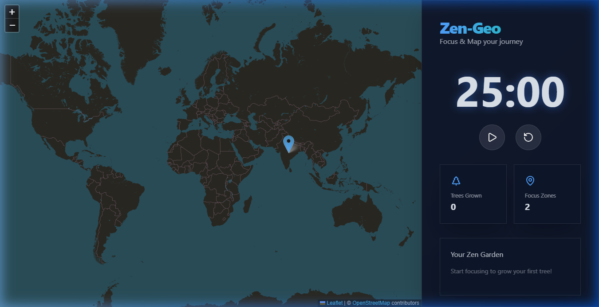

# Zen-Geo | Focus & Map Your Journey 🧘‍♂️📍



**Zen-Geo** is a premium, unique productivity application that combines a gamified Pomodoro timer with location-based memory mapping. Designed for developers and thinkers, it helps you stay focused while documenting your physical and mental journey on an interactive map.

## ✨ Key Features

-   **Interactive Dark-Mode Map**: A sleek, high-contrast map (via Leaflet) to pin your memories and "Focus Zones."
-   **Gamified Pomodoro Timer**: A functional 25-minute timer with a glassmorphic design that scales with your focus.
-   **Zen Garden**: Watch your virtual garden grow! Every completed session adds a tree to your dashboard.
-   **Geo-Notes**: Click any spot on the map to save a persistent note (stored via LocalStorage).
-   **Glassmorphism Branding**: A premium UI built with **Tailwind CSS 4** and **Framer Motion**.

## 🚀 Tech Stack

-   **Frontend**: React 19 + Vite
-   **Styling**: Tailwind CSS 4 (Utility-first)
-   **Animations**: Framer Motion
-   **Mapping**: Leaflet & React-Leaflet
-   **Icons**: Lucide React
-   **Persistence**: Browser LocalStorage

## 🛠️ Getting Started

1.  **Clone the repo**:
    ```bash
    git clone https://github.com/khushkamal/note-Geo.git
    ```
2.  **Install dependencies**:
    ```bash
    npm install
    ```
3.  **Run the development server**:
    ```bash
    npm run dev
    ```

## 📸 Screenshots

-   **Dashboard**: Premium dark theme with real-time map integration.
-   **Garden View**: Visual representation of your focus history.
-   **Persistence**: Your data stays even after a refresh!

---
*Created by [Khushkamal Singh](https://github.com/khushkamal) with ❤️ for the Developer Community.*
